```{r setup, include=FALSE}
options(htmltools.dir.version = FALSE)
knitr::opts_chunk$set(collapse = TRUE,
                      message = FALSE, 
                      warning = FALSE, 
                      fig.align = TRUE, 
                      cache = FALSE, 
                      eval = FALSE, 
                      fig.retina = 3)

library(ymlthis)
library(tidyverse)
library(xaringanExtra)
xaringanExtra::use_panelset()
xaringanExtra::use_share_again()
xaringanExtra::style_share_again(
  share_buttons = c("twitter", "linkedin", "pocket")
)

library(RefManageR)
bibs <- ReadBib("references.bib", check = FALSE)
```

```{r broadcast, echo=FALSE}
xaringanExtra::use_broadcast()
```


class: title-slide, center, middle


# `r rmarkdown::metadata$title`

## `r rmarkdown::metadata$author`

### `r rmarkdown::metadata$subtitle`
### `r rmarkdown::metadata$date`


???

Welcome to the webinar on sharing on short notice

Where we'll show you how to get your teaching materials online with R Markdown.

---
layout: true

<a class="footer-link" href="http://brunaw.com/recommendation_fairness/presentation/slides.html">https://bit.ly/2NqYr0O</a>

---

name: clouds
class: center, middle
background-image: url(images/sea.jpg)
background-size: cover

```{css, echo=FALSE}
.panelset {
  --panel-tab-font-family: Work Sans;
  --panel-tab-background-color-active: #fffbe0;
  --panel-tab-border-color-active: #023d4d;
}

.panelset .panel-tabs .panel-tab > a {
	color: #023d4d;
}
```


## .big-text[Hello]


### Bruna Wundervald


[GitHub: @brunaw](https://github.com/brunaw)  
[Twitter: @bwundervald](https://twitter.com/bwundervald)  
[Page: http://brunaw.com/](http://brunaw.com/)


---
class: middle

# Today:


- Algorithm Fairness 
  
???

Here's who I know you are...

--


- Music recommendation fairness   
  - Popularity 
  


--


- Tackling the popularity issue 
  


???

--

- Results 
  


???

--


???


---
class: middle, inverse

# Algorithm Fairness 

---
class: middle

# Algorithm Fairness 

- An algorithm is said to be *fair* if its results are independent
of certain **variables**:
  - Ethnicity, gender, disability, etc 
  
- Defining fairness might be very <b> context dependent </b> 
  - and it can also be very difficult due to its subjectivity 

- Has recently become a popular/strong area of research: 
  - More and more privacy & transparency issues
  - Facebook, Google, etc 
  - Discrimination laws 


---
class: middle, inverse

# Music recommendation fairness 

---
class: middle

# Music recommendation fairness 

- In `r Citep(bibs[key = "pap_unfairness"])`, the authors 
demonstrate that many recommendation algorithms are 
biased towards popular artists 

- In practice, this leads to already popular artists being 
recommended too many times 

- Unfairness:
  - To the users, because they `get recommended artists they probably already know`
  - To the artists, because newer/less popular artists `get less recommended than they deserve`


---
class: middle, inverse

# Tackling the popularity issue

---
class: middle

## Standard prediction method 

- After a recommendation system is fit, we select the 
`Top-N` best recommendations for each user and 
make that the predictions

- Issue:
  - Leads to high popularity unfairness in some cases
  
  
> New approach: change the way the predictions are
made such that the popularity distribution is taken
into account 

---
class: small, middle

## New prediction method 

1. Define a set of users $\mathcal{U}$, 
their music consumption history $\mathcal{I}_{\mathcal{U}}$,
the set of artists $A_{\mathcal{I}}$, and
their popularity as $\boldsymbol{Pop}_{A}$
  
2.  Assume the existence
of a hidden variable $z_k, k  \in \{1,\dots,K\}$ 
  in the artist popularity, 
assume it's distribution to be a
Gaussian Mixture and estimate its parameters via the EM algorithm: 

    $$\mathcal{P}=(\boldsymbol{Pop}_{A_{i}} |\boldsymbol{\theta}) = \sum_{k = 1}^{K} \pi_k \mathcal{N}(\boldsymbol{Pop}_{A_{i}}   | \boldsymbol{\mu}_k, \boldsymbol{\Sigma}_k),$$

3. Adapt the predictions in a way that it
respects the proportions of each estimated cluster:
  - Predict artists from each cluster based on
  $k$ "quotas" sampled from a  $\text{Multinomial}(\textbf{m}, \boldsymbol{\theta} \approx (\pi_1,\dots, \pi_{K}))$, with m = number of artists to be recommended 

---

```{r, eval = TRUE, echo = FALSE, out.width="55%", fig.align='center'}
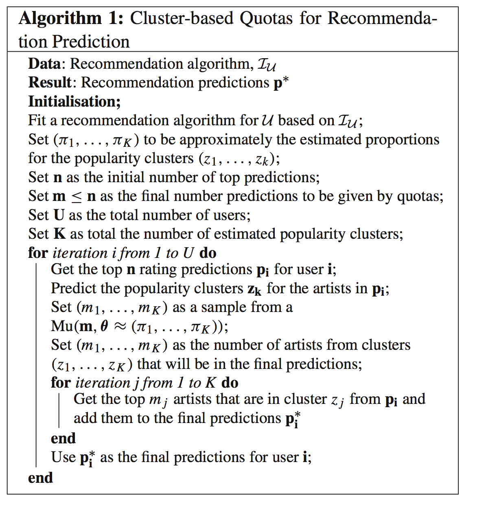
```

---
class: middle

## Advantages
  
- Is not algorithm dependent
- Does not add any complex steps 
- Easily adapted to different fairness contexts
- Stochastic, leading to less bias in the selected
artists

---
class: middle

## Data 
  
  - A sample of the LFM-1b dataset (listening events from Last.fm), 3000 users separated into three mainstreaminess groups:
    - low (1000 users), medium (1000 users) and
high (1000 users)

- Mainstreaminess: overlap between the listening history of a user and 
the overall listening history of all Last.fm users
  - `How popular are the artists the user listens to` 

- Total: 1.755.361 user-artist interactions and 352.805  artists

- 80%/20% train and test separation (for each group)

- Popularity: the fraction of users that interacted with each artist 
(between 0 and 1)

---
class: middle

## Recommendation Algorithms 
  
  
- `User Item Average`: based on the average listening counts for each user
- `User KNN`: a K-nearest neighbors based method 
- `User KNN-Average`: a K-nearest neighbors based method combined
with the average listening counts for each user
- `Non-Negative Matrix Factorization (NMF)`: factorizes the user-artist interaction matrix in order to approximate each user's preferences


> Goal: to make their predictions more 'fair'
in popularity terms 

---
class: middle

## Before (top-n recommendations)

% $\Delta$ GAP:  how much the popularity of the predictions differs from the expected popularity of the artists in the user profiles of the test set

```{r, eval = TRUE, echo = FALSE, out.width="75%", fig.align='center'}
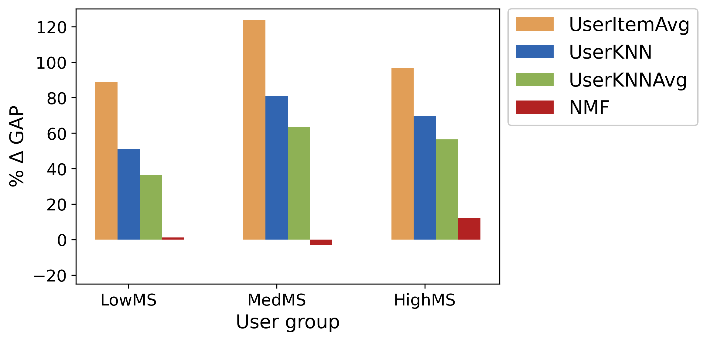
```


---
class: middle, inverse

# Results

---
class: middle 

## Results: cluster distribution 


```{r, eval = TRUE, echo = FALSE, out.width="70%", fig.align='center'}
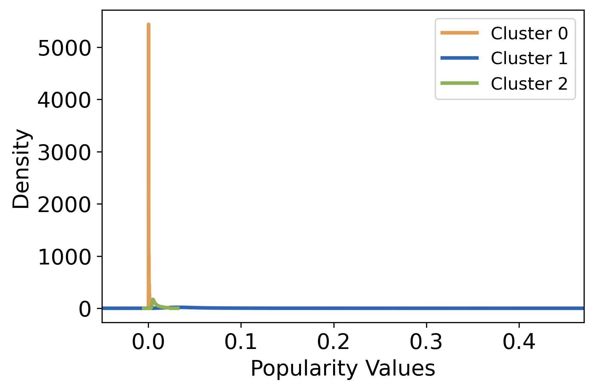
```


---
class: middle 

## Results: % $\Delta$ GAP


```{r, eval = TRUE, echo = FALSE, out.width="85%", fig.align='center'}
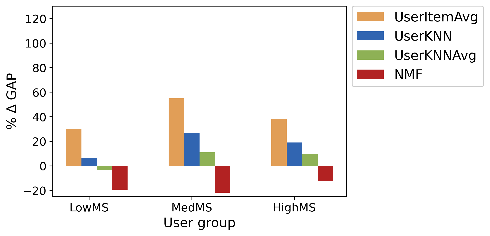
```


---

## Results: recommendation frequencies

.panelset[
.panel[.panel-name[UserItemAvg: Before]

```{r, eval = TRUE, echo = FALSE, out.width="60%", fig.align='center'}
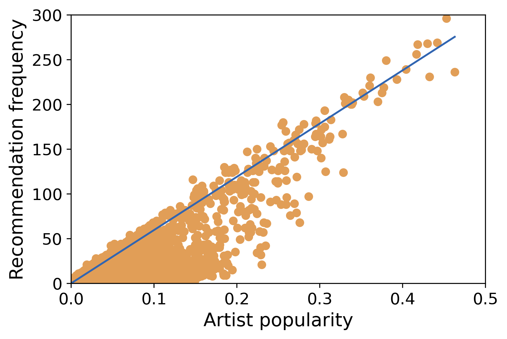
```

]

.panel[.panel-name[UserItemAvg: After]

```{r, eval = TRUE, echo = FALSE, out.width="60%", fig.align='center'}
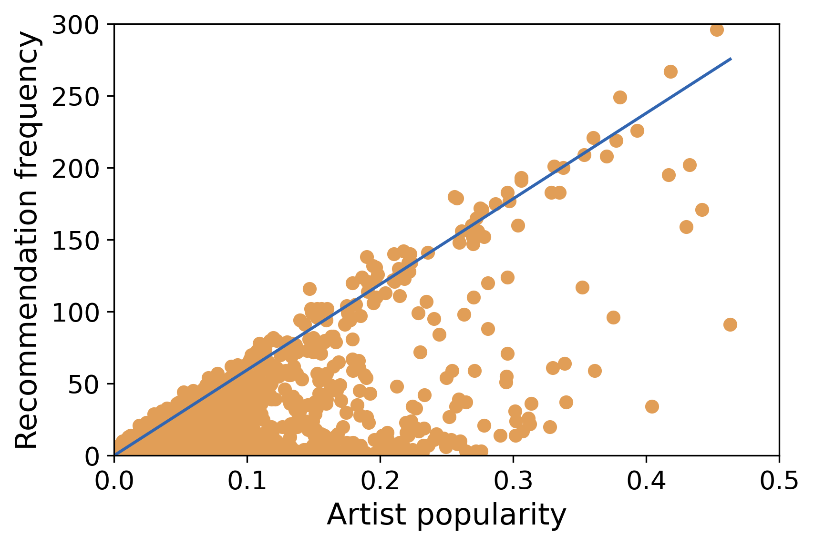
```
]
]


---
class: middle

## Results: recommendation frequencies

.panelset[
.panel[.panel-name[UserKNN: Before]

```{r, eval = TRUE, echo = FALSE, out.width="60%", fig.align='center'}
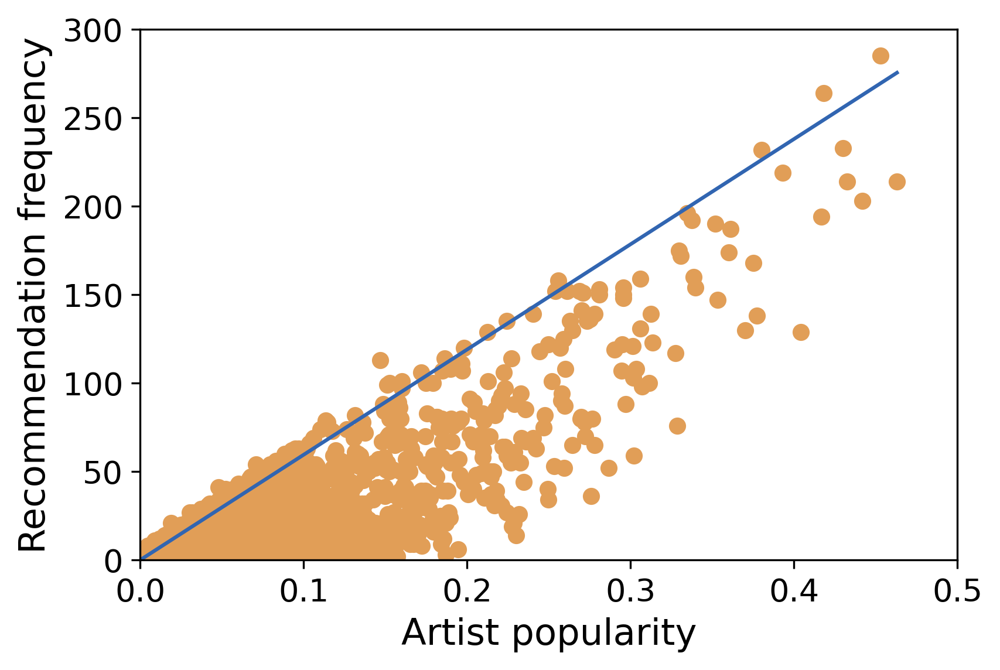
```

]

.panel[.panel-name[UserKNN: After]

```{r, eval = TRUE, echo = FALSE, out.width="60%", fig.align='center'}
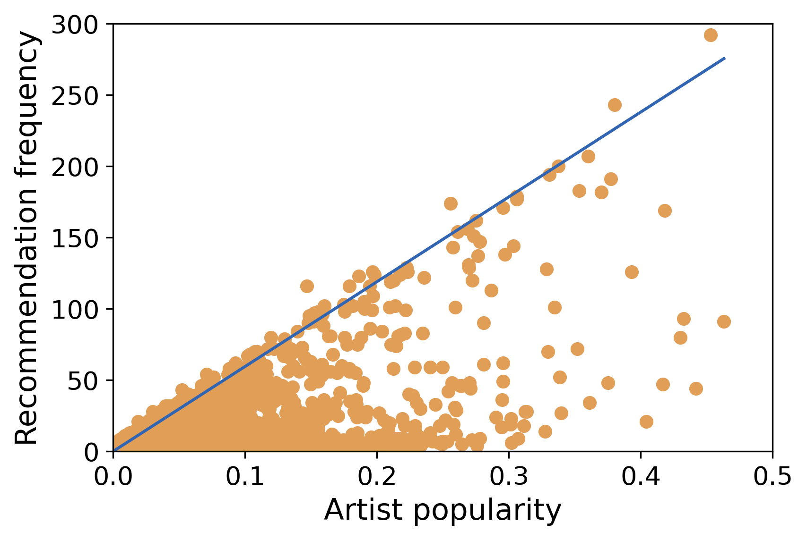
```
]
]

---
class: middle

## Results: recommendation frequencies

.panelset[
.panel[.panel-name[UserKNNAvg: Before]

```{r, eval = TRUE, echo = FALSE, out.width="60%", fig.align='center'}
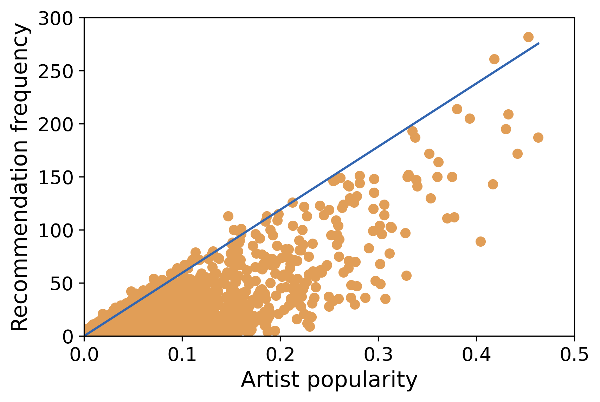
```

]

.panel[.panel-name[UserKNNAvg: After]

```{r, eval = TRUE, echo = FALSE, out.width="60%", fig.align='center'}
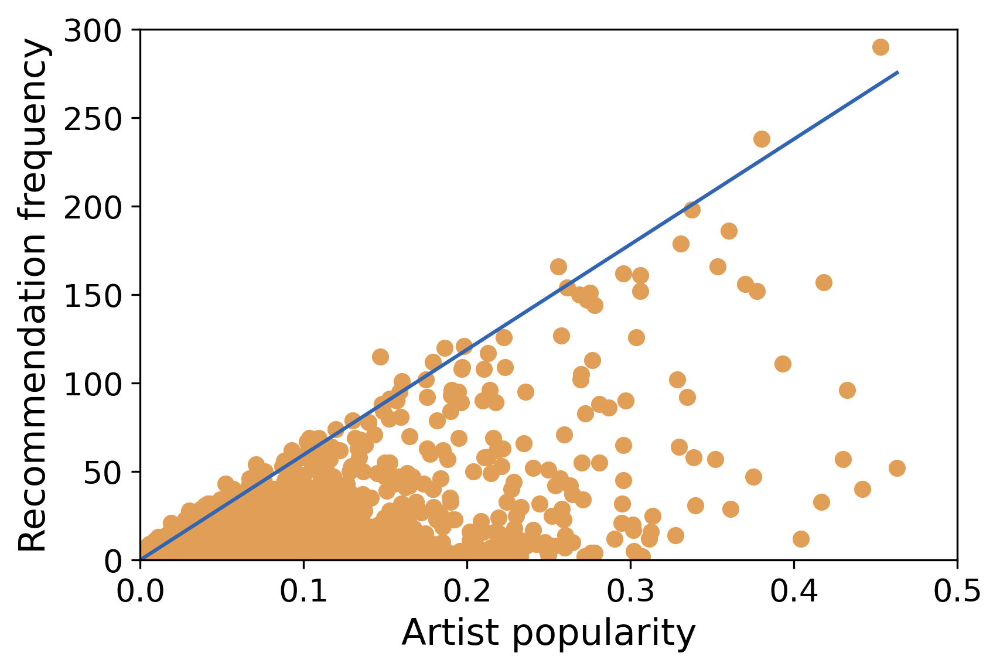
```
]
]

---
class: middle

## Results: recommendation frequencies

.panelset[
.panel[.panel-name[NMF: Before]

```{r, eval = TRUE, echo = FALSE, out.width="60%", fig.align='center'}
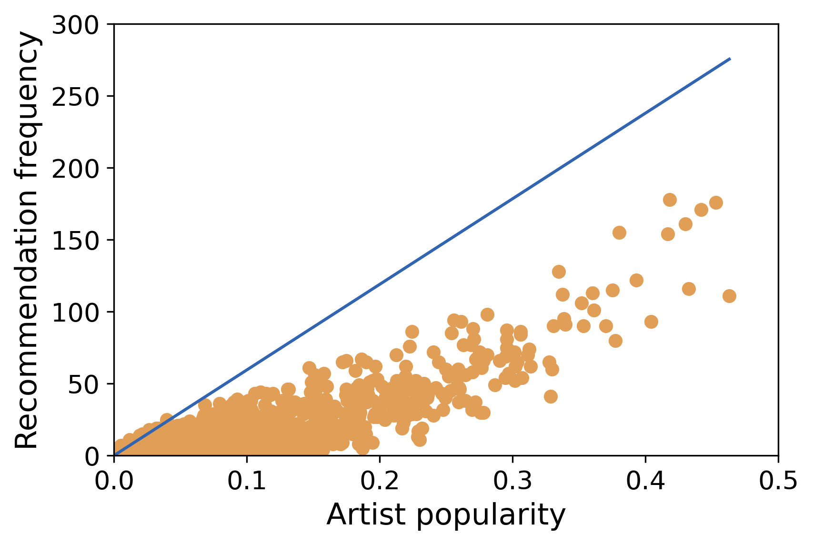
```

]

.panel[.panel-name[NMF: After]

```{r, eval = TRUE, echo = FALSE, out.width="60%", fig.align='center'}
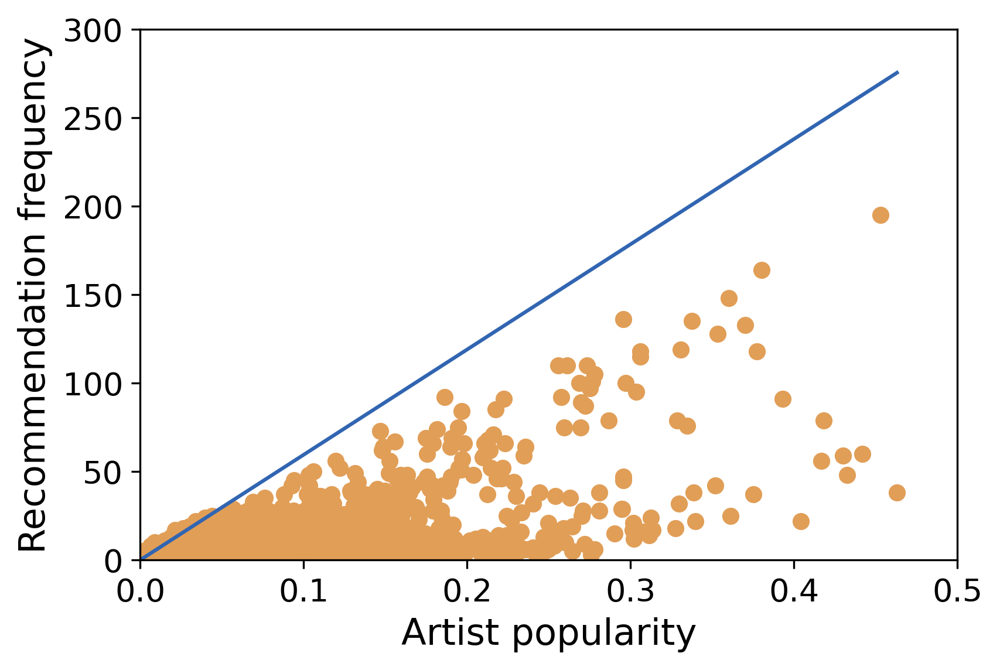
```
]
]


---
class: middle 

## Results: Mean Average Error (MAE) 


```{r, eval = TRUE, echo = FALSE, out.width="95%", fig.align='center', fig.cap="Average MAE results for the 4 music recommendation systems, with percentual differences in parentheses. For almost all cases, there is an accuracy improvement with the new algorithm"}
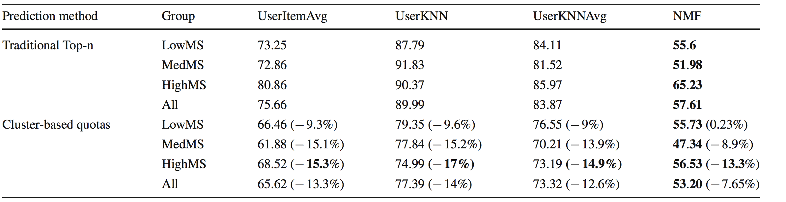
```

---
class: middle

# Paper

> https://github.com/brunaw/recommendation_fairness


```{r, eval = TRUE, echo = FALSE, out.width="75%", fig.align='center'}
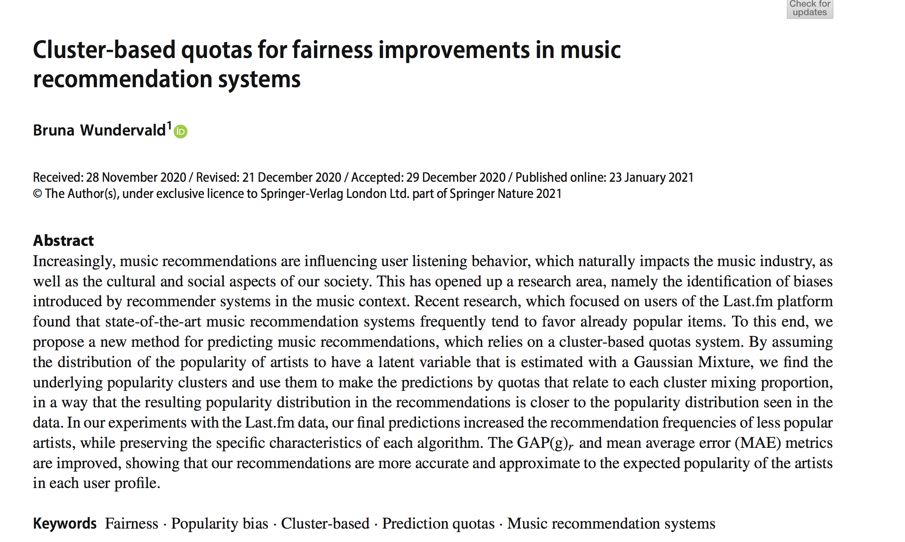
```


---
class: middle

# References

```{r, echo = FALSE, eval = TRUE, results='asis'}
print(bibs, 
      .opts = list(check.entries = FALSE, 
                   style = "html", 
                   bib.style = "authoryear"))
```


---
background-image: url(images/sea.jpg)
background-size: cover
class: center, middle, inverse

## .big-text[Questions?]

---


class: bottom, left, inverse


## Thank you!

### Find me at...


[`GitHub: @brunaw`](https://github.com/brunaw)

[`Twitter: @bwundervald`](https://twitter.com/bwundervald)

[`Page: http://brunaw.com/`](http://brunaw.com/)

